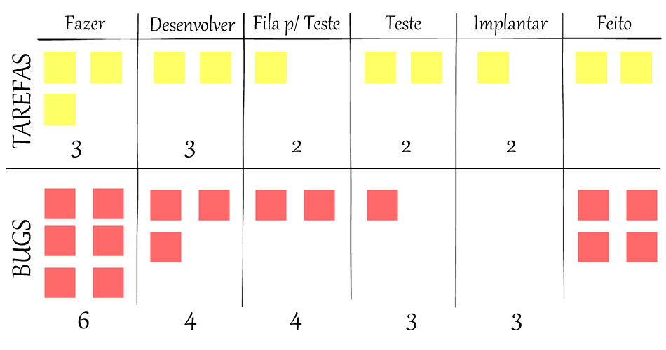

# 4. Planejamento do Projeto

> Aqui será feito o gerenciamento das tarefas de implementação do projeto.

## 4.1. Divisão de Papéis

> Apresente a divisão de papéis entre os membros do grupo em cada sprint. O desejável é que, em cada sprint, o aluno assuma papéis diferentes na disciplina. Siga o modelo do exemplo abaixo:

### Sprint 1
- _Scrum master_: AlunaX
- Protótipos: AlunoY
- Testes: AlunoK
- Documentação: AlunaZ

### Sprint 2
- _Scrum master_: AlunaY
- Desenvolvedor _front-end_: AlunoX
- Desenvolvedor _back-end_: AlunoK
- Testes: AlunaZ

## 4.2. Quadro de tarefas

> Apresente a divisão de tarefas entre os membros do grupo e o acompanhamento da execução, conforme exemplo abaixo.

## Sprint 1

Atualizado em: 21/04/2024

| Responsável   | Tarefa/Requisito | Iniciado em    | Prazo      | Status | Terminado em    |
| :----         |    :----         |      :----:    | :----:     | :----: | :----:          |
| AlunaX        | Introdução | 01/02/2024     | 07/02/2024 | ✔️    | 05/01/2005      |
| AlunaZ        | Objetivos    | 03/02/2024     | 10/02/2024 | 📝    |                 |
| AlunoY        | Histórias de usuário  | 01/01/2024     | 07/01/2005 | ⌛     |                 |
| AlunoK        | Personas 1  |    01/01/2024        | 12/02/2005 | ❌    |       |

## Sprint 2

Atualizado em: 21/04/2024

| Responsável   | Tarefa/Requisito | Iniciado em    | Prazo      | Status | Terminado em    |
| :----         |    :----         |      :----:    | :----:     | :----: | :----:          |
| AlunaX        | Home-Page        | 01/02/2024     | 07/03/2024 | ✔️    | 05/01/2005      |
| AlunaZ        | CSS Unificado    | 03/02/2024     | 10/03/2024 | 📝    |                 |
| AlunoY        | Página de login  | 01/02/2024     | 07/03/2024 | ⌛     |                 |
| AlunoK        | Script de login  |  01/01/2024    | 12/03/2024 | ❌    |       |

Legenda:
- ✔️: terminado
- 📝: em execução
- ⌛: atrasado
- ❌: não iniciado

Outra maneira que pode ser utilizada para facilitar o planejamento das tarefas, recomenda-se a utilização da ferramenta Trello ([https://trello.com]). O Trello é uma plataforma intuitiva e eficiente para gerenciar tarefas e projetos de forma colaborativa.

Para começar, crie um quadro Kanban no Trello. Siga estas etapas:
1. Crie um Quadro: No Trello, crie um novo quadro para a sua sprint.
2. Listas do Quadro: Divida o quadro em listas que representem os estágios do fluxo de trabalho, como "A Fazer", "Desenvolver", "Fila para Teste", “Teste” e “Feito”.  
  
  **OBS: a coluna IMPLANTAR não é importante para o contexto do Trabalho Interdisciplinar, por isso ela NÃO deve estar presente no seu Quadro. 
  
  **Exemplo do um Kanban**:

 

Fonte: [http://www.sindicontitajai.org.br/noticias-empresariais/kanban-como-utilizar-para-gerenciar-diversos-projetos] 

3. Cartões: Dentro de cada lista, adicione cartões para representar as tarefas individuais que precisam ser realizadas durante a sprint.
4. Detalhes das Tarefas: Em cada cartão, adicione detalhes como descrição da tarefa, responsável, prazo e qualquer informação relevante.
5. Priorização: Priorize as tarefas dentro de cada lista, colocando as mais importantes no topo. Movimentação de Cartões: Conforme o trabalho avança, mova os cartões entre as listas para refletir seu progresso.
6. Revisão Diária: Faça revisões regulares do quadro Kanban durante a sprint para acompanhar o progresso e ajustar as prioridades, se necessário. 

## Links Úteis
> - [11 Passos Essenciais para Implantar Scrum no seu Projeto](https://mindmaster.com.br/scrum-11-passos/)
> - [Scrum em 9 minutos](https://www.youtube.com/watch?v=XfvQWnRgxG0)

